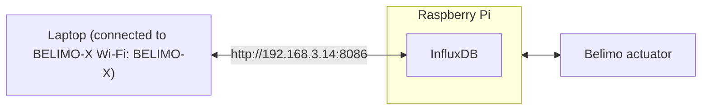

# Belimo Hackathon — Actuator + Raspberry Pi + InfluxDB

Welcome to the **Belimo 2026-start-hack** hackathon repository! This setup lets you **control a Belimo LM/CQ actuator** and **observe real-time telemetry** via an **InfluxDB instance running on a Raspberry Pi 5**.

> **Key idea:** Your code does **not** talk to the actuator directly.
> You **write commands to InfluxDB** (measurement: `_process`) and the Raspberry Pi logger applies them to the actuator over **MP‑Bus (serial)** and continuously logs back telemetry (measurement: `measurements`).

---

## Table of contents

- [System overview](#system-overview)
- [Network & access](#network--access)
- [InfluxDB data model](#influxdb-data-model)
  - [Measurements](#measurements)
  - [Telemetry fields](#telemetry-fields-measurements)
  - [Command fields](#command-fields-_process)
  - [Timestamps & why epoch time is used](#timestamps--why-epoch-time-is-used)
  - [⚠️ Important notice: data persistence on reboot](#️-important-notice-data-persistence-on-reboot)
- [What runs on the Raspberry Pi (logger)](#what-runs-on-the-raspberry-pi-logger)
  - [Logger loop: read → combine → write → apply setpoint](#logger-loop-read--combine--write--apply-setpoint)
  - [Sampling behavior](#sampling-behavior)
- [Repository structure](#repository-structure)
- [Quick start](#quick-start)
  - [A) Check data in InfluxDB UI](#a-check-data-in-influxdb-ui)
  - [B) Run the actuator demo container (`demo/`)](#b-run-the-actuator-demo-container-demo)
- [The `demo/` directory (new demos setup)](#the-demo-directory-new-demos-setup)
  - [What’s inside `demo/`](#whats-inside-demo)
  - [How the container chooses Streamlit vs CLI](#how-the-container-chooses-streamlit-vs-cli)
  - [Streamlit UI: what users can choose](#streamlit-ui-what-users-can-choose)
  - [Streamlit loop logic (how it writes and plots)](#streamlit-loop-logic-how-it-writes-and-plots)
  - [CLI: arguments and output](#cli-arguments-and-output)
  - [Waveform generator (`signal/waveform.py`)](#waveform-generator-signalwaveformpy)
- [How to build your own solution](#how-to-build-your-own-solution)
- [Common Flux queries (Influx UI)](#common-flux-queries-influx-ui)
- [Troubleshooting / FAQ](#troubleshooting--faq)
- [Safety & etiquette](#safety--etiquette)

---

## System overview

**Hardware / services**

- **Raspberry Pi 5**
  - Runs its own Wi‑Fi hotspot
  - Runs **InfluxDB**
  - Runs a **logger service** that bridges InfluxDB ↔ actuator
- **Belimo LM/CQ actuator**
  - Connected to the Pi over **serial interface**
  - Communication protocol: **MP‑Bus**

**Data flow**



The system starts logging automatically as soon as the Raspberry Pi and actuator are powered.

---

## Network & access

1) **Connect to the Raspberry Pi hotspot**

- **SSID:** `BELIMO-X` where `X` is a number `0–9` (printed on the label on the Raspberry Pi)
- **Password:** `raspberry`

2) **Open InfluxDB UI**

- **URL:** http://192.168.3.14:8086
- **Username**: pi
- **Password**: raspberry

> You must be connected to the `BELIMO-X` Wi‑Fi to reach the InfluxDB instance.

---

## InfluxDB data model

### Measurements

The setup uses **two Influx _measurement folders**:

1) **`measurements`** (telemetry)
- Continuously logged actuator telemetry + the latest command values

2) **`_process`** (commands)
- Your code writes commands here (setpoint + test tag)

The InfluxDB **bucket** is:

- **Bucket:** `actuator-data`

---

### Telemetry fields (`measurements`)

These fields are logged continuously:

- `setpoint_position_%` — command target position (0–100)
  - `0` = closed, `100` = open
- `feedback_position_%` — measured shaft position (0–100)
- `rotation_direction` — `0` still, `1` opening, `2` closing
- `motor_torque_Nmm` — torque in Nmm (sign not consistent with rotation direction)
- `power_W` — power in W
- `internal_temperature_deg_C` — internal PCB temperature (°C)
- `test_number` — experiment tag (default `-1`)

---

### Command fields (`_process`)

To move the actuator you write a command into `_process` with:

- `setpoint_position_%` — desired position, float in `[0, 100]`
- `test_number` — integer tag to identify your experiment

The underlying system on the raspberry pi monitors `_process` and applies the setpoint to the actuator when it changes.

---

### Timestamps & why epoch time is used

Commands written to `_process` use a constant timestamp at Unix epoch:

- `timestamp = 1970-01-01T00:00:00Z` (created with `datetime.fromtimestamp(0, tz=timezone.utc)`)

**Why?**

- Prevents issues when devices have unsynchronized clocks
- Ensures “latest command” queries work reliably even if your laptop and the Raspberry Pi time differ

Telemetry in `measurements` uses the pi's uncalibrated time. The timestamps relative to each other are correct, but the absolute timestamp is offset.

---

### ⚠️ Important notice: data persistence on reboot

The InfluxDB instance on the Raspberry Pi **does not persist data**.
Any time the Raspberry Pi reboots, the entire InfluxDB bucket is cleared.

#### What gets wiped

All data inside the `actuator-data` bucket is deleted, including:

- `measurements`
- `_process`

After reboot, the logger starts writing fresh data as soon as it reconnects to the actuator.

#### What you must do

- If you need your experiment data, **export it to your laptop during your session**.

#### Best practices

- Download your data via the InfluxDB UI or client.
- Label your experiments using `test_number`.
- Regularly save relevant output locally.

---

## Sampling behavior

- The actuator values are read sequentially, as fast as possible.
- There is **no explicit fixed sampling period**.

---

## Repository structure

**Demo layout:**

```
demo/
  interface/
    influx/api.py        # InfluxDB helpers (read telemetry, write functions)
  signal/
    waveform.py          # waveform generators (constant/sine/triangle/square)
  app.py                 # Streamlit app (control + plot)
  main.py                # CLI app (control + terminal output)
  entrypoint.sh          # selects Streamlit vs CLI
  Dockerfile             # builds the demo container
```
---

## Quick start

### A) Check data in InfluxDB UI

1. Connect to Wi‑Fi: `BELIMO-X` (password `raspberry`)
2. Open InfluxDB: http://192.168.3.14:8086
3. Find bucket `actuator-data`
4. Verify _measurement folder `measurements` is updating

If `measurements` is updating, the underlying system on the raspberry pi is running and the actuator is connected.

---

### B) Run the actuator demo container (`demo/`)

The `demo/` container can run in two modes:

- **Streamlit mode** (default): no arguments → launches the web UI
- **CLI mode**: pass arguments → runs `python main.py <args>`

#### Build the container

From inside the `demo/` folder:

```bash
docker build -t demo .
```

---

#### Run Streamlit

```bash
docker run --rm -it -p 8501:8501 -v ${PWD}:/work demo
```

Then open:

- http://localhost:8501

---

#### Run CLI

```powershell
docker run --rm -it -v ${PWD}:/work demo --waveform sine --frequency 0.1 --bias 50 --amplitude 30 --test-number 1
```

Results are printed in the terminal.
---

# How to build your own solution

You can implement your own controller, visualizer, or analysis tool by interacting with InfluxDB.

At minimum:

- Write commands to `_process` (`setpoint_position_%` + `test_number`)
- Read telemetry from `measurements`

If you use the provided `demo/interface/influx/api.py`, you can follow the patterns used in `demo/app.py` and `demo/main.py`.

---

## Troubleshooting / FAQ

Come talk to us! We are here to support you. 
---

## Safety & etiquette

- Keep setpoint positions within `0–100`.
- Keep `test_number` values as integers.
- Avoid spamming commands at extremely high rates.
- Use `test_number` to clearly mark your experiments so you can filter your data later.
- Don't stick your finger inside valve/dampers ... :)


---

# **Happy hacking! 🚀**
